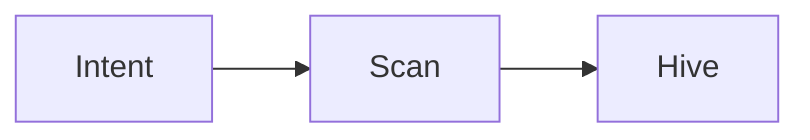

# Ready Room intent

## Commander intent

REPLACE WITH YOUR INTENT — one clear sentence.

## Mode

- **DRILL** — sights on (change `mode: live` for kill shot)

## Notes

- Logic maps, rules, constraints below
- Sync vault → system scans pending intents

## Operational notes

-

## Logic map

